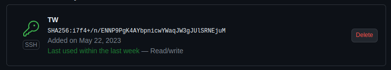
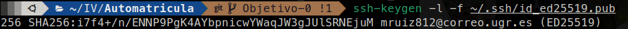
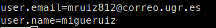

# Automatricula

## Descripción del problema

Soy un alumno universitario que quiere solucionar los problenmas de incompatibilidad horarias de las diferentes asignaturas que tengo.

## Historias de usuario y Milestone

- [Historias de usuario](./doc/historias_usuario.md)

- [Milestone](./doc/milestone.md)

# Configuración de GitHub

## Configuración de claves

## Configuración del usuario y el mail en el equipo local

## Perfil de GitHub reconocible

